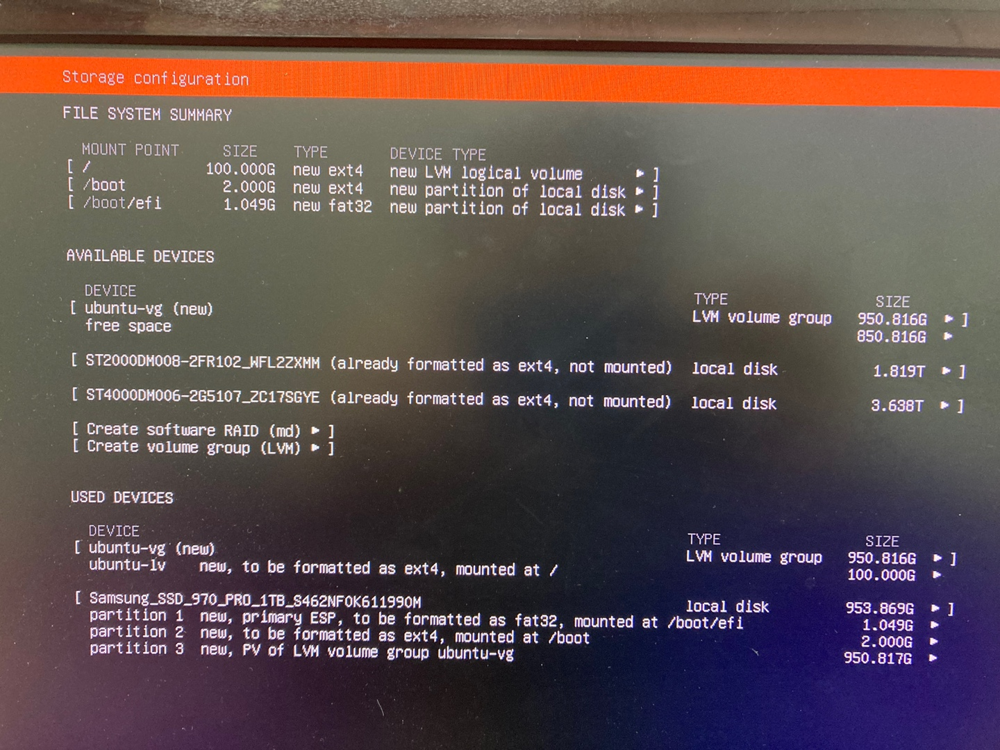
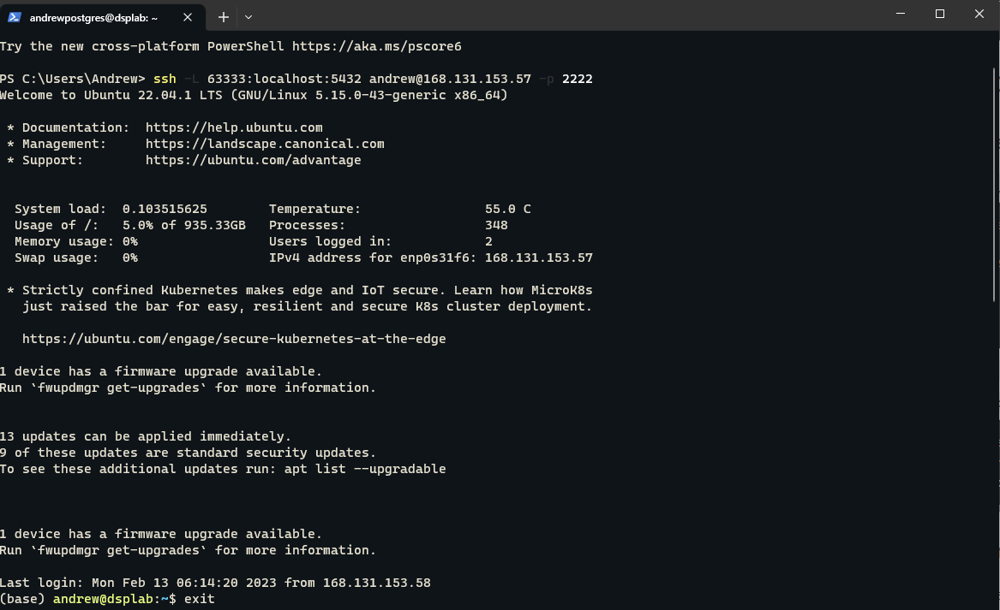
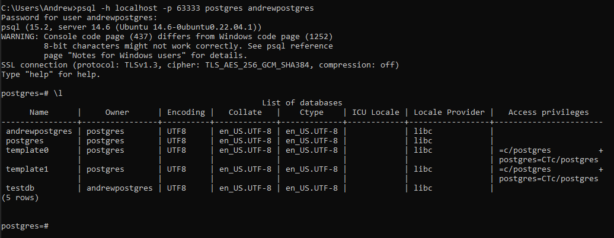
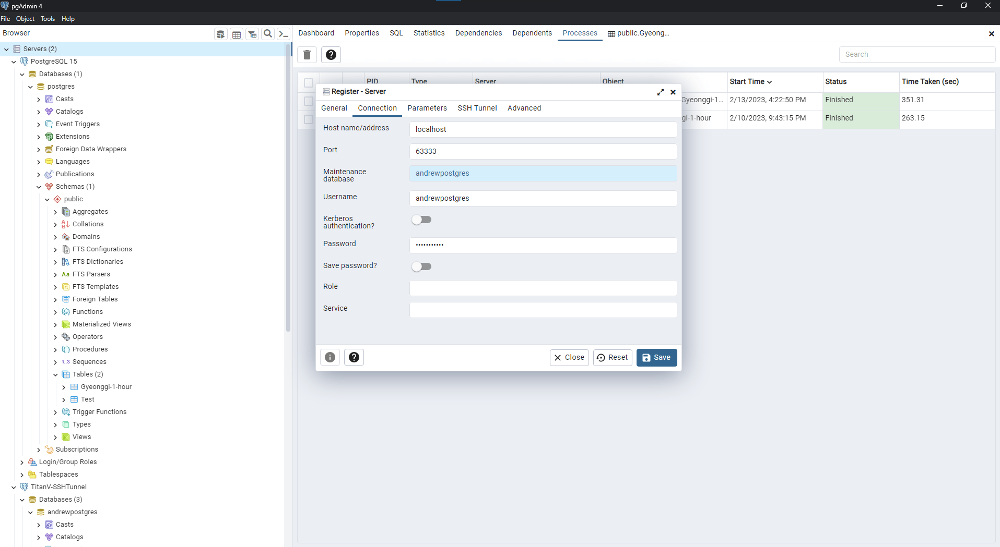

# Contents:
1. [Install Ubuntu OS](#install-ubuntu-os)
2. [Configure static IP](#config-the-static-ip)
3. [Increase size of Disk storage](#-incase-you-setup-by-defaul-storage-and-you-wanna-increase-size-of-disk)
4. [Install CUDA and CuDNN](#install-cuda--cudnn)
5. [Install Anaconda](#install-anaconda)
6. [Mount the extend Drive](#auto-mount-drive)
7. [Config Firewall](#config-firewall)
8. [Share folders via Samba](#install-and-configure-samba)

    8.1. [Configure the permission folder](#change-the-permission-folder-files-to-limit-access)
9. [SSH configuration](#public-ssh-port-to-be-accessible-remote-with-secure)

    9.1. [SSH via SSH-KEYS(No login required)](#ssh-via-key-pair)
10. [Install PostgreSQL database](#install-and-config-the-postgresql-database-for-ubuntu-server-22041-lts)

    10.1. [Installation](#1-installation)
    
    10.2. [Configuration](#2-configuration)
        
    *10.2.1.* [Change the Directory to storage dataset in server](#21-move-a-postgresql-data-directory-to-a-new-location)
    
    *10.2.2.* [Public the database via SSH tunnels](#22-secure-tcpip-connections-with-ssh-tunnels)
   
    
    10.3. [PGAdmin 4](#23-pgadmin-4-to-manage-the-dataset)
    
    10.4. [Public Database (Not recommended)](#24-allow-remote-connections)

# Install Ubuntu OS
- Download iso file from offical Ubuntu website
- Using Rufus (or other apps) to burn the iso into USB
- Plugin USB Boot to Server and follow the steps on screen to install OS

    

# Config the static IP
`Access file: ` 
```powershell
sudo nano /etc/netplan/00-installer-config.yaml
```

 **then modify to:**
```dockerfile
# This is the network config written by 'subiquity'
network:
  ethernets:
    enp0s31f6:
      dhcp4: no
      addresses: 
        - 168.131.153.57/24
      routes:
        - to: default
          via: 168.131.153.1
      nameservers: 
        addresses: [168.131.33.5, 168.131.33.6]
    enp4s0:
      dhcp4: true
  version: 2
```

### Update the OS after installation
```
sudo apt-get update
sudo apt-get upgrade
```
Note: Waiting 3-5 min

### :warning: Incase you setup by defaul storage, and you wanna increase size of Disk:

1. If the result of `Free PE / Size` is not **Zero**
2. Execute `lvextend -l +100%FREE /dev/ubuntu-vg/ubuntu-lv`.
First, run `df -h` to verify your (almost full) root file system, then run `resize2fs /dev/mapper/ubuntu--vg-ubuntu--lv` to extend your filesystem, and run `df -h` one more time to make sure you’re successful
    - Before:
    ```
        root@dsplab:/home/andrew# lsblk -l
        NAME                  MAJ:MIN RM   SIZE RO TYPE MOUNTPOINTS
        loop0                   7:0    0    62M  1 loop /snap/core20/1587
        loop1                   7:1    0  79.9M  1 loop /snap/lxd/22923
        loop2                   7:2    0    47M  1 loop /snap/snapd/16292
        sda                     8:0    0   1.8T  0 disk 
        sdb                     8:16   0   3.6T  0 disk 
        ubuntu--vg-ubuntu--lv 253:0    0   100G  0 lvm  /
        nvme0n1               259:0    0 953.9G  0 disk 
        nvme0n1p1             259:1    0     1G  0 part /boot/efi
        nvme0n1p2             259:2    0     2G  0 part /boot
        nvme0n1p3             259:3    0 950.8G  0 part 
    ```
    - After:
    ```
        root@dsplab:/home/andrew# lsblk -l
        NAME                  MAJ:MIN RM   SIZE RO TYPE MOUNTPOINTS
        loop0                   7:0    0    62M  1 loop /snap/core20/1587
        loop1                   7:1    0  79.9M  1 loop /snap/lxd/22923
        loop2                   7:2    0    47M  1 loop /snap/snapd/16292
        sda                     8:0    0   1.8T  0 disk 
        sdb                     8:16   0   3.6T  0 disk 
        ubuntu--vg-ubuntu--lv 253:0    0 950.8G  0 lvm  /
        nvme0n1               259:0    0 953.9G  0 disk 
        nvme0n1p1             259:1    0     1G  0 part /boot/efi
        nvme0n1p2             259:2    0     2G  0 part /boot
        nvme0n1p3             259:3    0 950.8G  0 part 
    ```


:flight_departure: **Keywords**: Ubuntu: Extend your default LVM space

# Install NVIDIA driver (Skip this step if you wanna isntall CUDA then)

1. First, detect the model of your nvidia graphic card and the recommended driver
    ```
    andrew@dsplab:~$ ubuntu-drivers devices
    == /sys/devices/pci0000:16/0000:16:00.0/0000:17:00.0/0000:18:08.0/0000:19:00.0 ==
    modalias : pci:v000010DEd00001D81sv000010DEsd00001218bc03sc00i00
    vendor   : NVIDIA Corporation
    model    : GV100 [TITAN V]
    driver   : nvidia-driver-510 - distro non-free
    driver   : nvidia-driver-418-server - distro non-free
    driver   : nvidia-driver-470-server - distro non-free
    driver   : nvidia-driver-470 - distro non-free
    driver   : nvidia-driver-390 - distro non-free
    driver   : nvidia-driver-515-server - distro non-free
    driver   : nvidia-driver-525 - distro non-free recommended
    driver   : nvidia-driver-450-server - distro non-free
    driver   : nvidia-driver-525-server - distro non-free
    driver   : nvidia-driver-515 - distro non-free
    driver   : xserver-xorg-video-nouveau - distro free builtin
    ```
2. Install driver (should install the driver with "recommend"). And dont worry about driver-version is not latest, you can compare the latest on [official nvidia website](https://www.nvidia.com/en-us/drivers/unix/)
    ```
    sudo apt install nvidia-driver-525
    ```
3. Reboot the server
    ```
    sudo reboot
    ```
    ```
    andrew@dsplab:~$ nvidia-smi 
    Sun Feb 12 08:34:42 2023       
    +-----------------------------------------------------------------------------+
    | NVIDIA-SMI 525.78.01    Driver Version: 525.78.01    CUDA Version: 12.0     |
    |-------------------------------+----------------------+----------------------+
    | GPU  Name        Persistence-M| Bus-Id        Disp.A | Volatile Uncorr. ECC |
    | Fan  Temp  Perf  Pwr:Usage/Cap|         Memory-Usage | GPU-Util  Compute M. |
    |                               |                      |               MIG M. |
    |===============================+======================+======================|
    |   0  NVIDIA TITAN V      Off  | 00000000:19:00.0 Off |                  N/A |
    | 36%   49C    P8    30W / 250W |      0MiB / 12288MiB |      0%      Default |
    |                               |                      |                  N/A |
    +-------------------------------+----------------------+----------------------+
    |   1  NVIDIA TITAN V      Off  | 00000000:68:00.0 Off |                  N/A |
    | 39%   52C    P8    28W / 250W |      0MiB / 12288MiB |      0%      Default |
    |                               |                      |                  N/A |
    +-------------------------------+----------------------+----------------------+
                                                                                   
    +-----------------------------------------------------------------------------+
    | Processes:                                                                  |
    |  GPU   GI   CI        PID   Type   Process name                  GPU Memory |
    |        ID   ID                                                   Usage      |
    |=============================================================================|
    |  No running processes found                                                 |
    +-----------------------------------------------------------------------------+
    ```

# Install CUDA & Cudnn
1. Visit website https://developer.nvidia.com/cuda-toolkit-archive to download the server compatible version (high recommend to use `runfile(local)`file type)
2. Execute this file and follow the instruction (file is big, so we need to wait to extract)
3. Visit website https://developer.nvidia.com/rdp/cudnn-archive to download CuDNN
4. Install CuDNN
- Extract the file
    ```
    tar xvf cudnn-linux-x86_64-8.7.0.84_cuda11-archive.tar.xz
    ```
- Copy cudnn files to /cuda folder    
    ```
    sudo cp cudnn-*-archive/include/cudnn*.h /usr/local/cuda/include
    sudo cp -P cudnn-*-archive/lib/libcudnn* /usr/local/cuda/lib64
    sudo chmod a+r /usr/local/cuda/include/cudnn*.h /usr/local/cuda/lib64/libcudnn*
    ```
- Adding Path into env: `nano ~/.bashrc`
```
# NVIDIA CUDA Toolkit
export PATH=/usr/local/cuda-11.7/bin:$PATH
export LD_LIBRARY_PATH=/usr/local/cuda-11.7/lib64/
```
5. Reboot server
6. Verify installation:

- ```/usr/local/cuda-11.7/extras/demo_suite/deviceQuery```

```powershell
> Peer access from NVIDIA TITAN V (GPU0) -> NVIDIA TITAN V (GPU1) : Yes
> Peer access from NVIDIA TITAN V (GPU1) -> NVIDIA TITAN V (GPU0) : Yes

deviceQuery, CUDA Driver = CUDART, CUDA Driver Version = 11.7, CUDA Runtime Version = 11.7, NumDevs = 2, Device0 = NVIDIA TITAN V, Device1 = NVIDIA TITAN V
Result = PASS
```
- **Install Tensorflow (System env) to verify the installation**
`pip install tensorflow`
```
andrew@dsplab:~/downloads$ python3
Python 3.10.6 (main, Nov 14 2022, 16:10:14) [GCC 11.3.0] on linux
Type "help", "copyright", "credits" or "license" for more information.
>>> import tensorflow as tf
2023-02-12 09:34:30.974561: I tensorflow/core/platform/cpu_feature_guard.cc:193] This TensorFlow binary is optimized with oneAPI Deep Neural Network Library (oneDNN) to use the following CPU instructions in performance-critical operations:  AVX2 AVX512F FMA
To enable them in other operations, rebuild TensorFlow with the appropriate compiler flags.
2023-02-12 09:34:31.644633: W tensorflow/compiler/xla/stream_executor/platform/default/dso_loader.cc:64] Could not load dynamic library 'libnvinfer.so.7'; dlerror: libnvinfer.so.7: cannot open shared object file: No such file or directory; LD_LIBRARY_PATH: /usr/local/cuda-11.7/lib64/
2023-02-12 09:34:31.644681: W tensorflow/compiler/xla/stream_executor/platform/default/dso_loader.cc:64] Could not load dynamic library 'libnvinfer_plugin.so.7'; dlerror: libnvinfer_plugin.so.7: cannot open shared object file: No such file or directory; LD_LIBRARY_PATH: /usr/local/cuda-11.7/lib64/
2023-02-12 09:34:31.644686: W tensorflow/compiler/tf2tensorrt/utils/py_utils.cc:38] TF-TRT Warning: Cannot dlopen some TensorRT libraries. If you would like to use Nvidia GPU with TensorRT, please make sure the missing libraries mentioned above are installed properly.
>>> tf.test.is_gpu_available()
WARNING:tensorflow:From <stdin>:1: is_gpu_available (from tensorflow.python.framework.test_util) is deprecated and will be removed in a future version.
Instructions for updating:
Use `tf.config.list_physical_devices('GPU')` instead.
2023-02-12 09:34:41.169491: I tensorflow/core/platform/cpu_feature_guard.cc:193] This TensorFlow binary is optimized with oneAPI Deep Neural Network Library (oneDNN) to use the following CPU instructions in performance-critical operations:  AVX2 AVX512F FMA
To enable them in other operations, rebuild TensorFlow with the appropriate compiler flags.
2023-02-12 09:34:42.502658: I tensorflow/core/common_runtime/gpu/gpu_device.cc:1613] Created device /device:GPU:0 with 9920 MB memory:  -> device: 0, name: NVIDIA TITAN V, pci bus id: 0000:19:00.0, compute capability: 7.0
2023-02-12 09:34:42.504050: I tensorflow/core/common_runtime/gpu/gpu_device.cc:1613] Created device /device:GPU:1 with 9917 MB memory:  -> device: 1, name: NVIDIA TITAN V, pci bus id: 0000:68:00.0, compute capability: 7.0
True
>>> 
```

### Incase you face the errors and wanna reisntall: Uninstall a GPU driver from Ubuntu
```powershell
sudo apt-get remove --purge nvidia-*
sudo apt autoremove --purge cuda-11.7
sudo rm -rf /usr/local/cuda-11.7
```
- To uninstall the CUDA Toolkit, run `cuda-uninstaller` in `/usr/local/cuda-11.7/bin`
- To uninstall the NVIDIA Driver, run `nvidia-uninstall`

# Install Anaconda
- Visit website https://www.anaconda.com/products/distribution
- Execute `sh Anaconda3-2022.10-Linux-x86_64.sh` and follow the instruction


# Auto Mount Drive 
1. Show all disks
```
andrew@dsplab:~$ lsblk
NAME                      MAJ:MIN RM   SIZE RO TYPE MOUNTPOINTS
loop0                       7:0    0    62M  1 loop /snap/core20/1587
loop1                       7:1    0  79.9M  1 loop /snap/lxd/22923
loop2                       7:2    0    47M  1 loop /snap/snapd/16292
sda                         8:0    0   1.8T  0 disk 
sdb                         8:16   0   3.6T  0 disk 
nvme0n1                   259:0    0 953.9G  0 disk 
├─nvme0n1p1               259:1    0     1G  0 part /boot/efi
├─nvme0n1p2               259:2    0     2G  0 part /boot
└─nvme0n1p3               259:3    0 950.8G  0 part 
  └─ubuntu--vg-ubuntu--lv 253:0    0 950.8G  0 lvm  /
```


2. Get Drive UUID and Type

```
(base) andrew@dsplab:/mnt$ lsblk -o NAME,FSTYPE,UUID,MOUNTPOINTS
NAME                      FSTYPE      UUID                                   MOUNTPOINTS
loop0                     squashfs                                           /snap/core20/1587
loop1                     squashfs                                           /snap/lxd/22923
loop2                     squashfs                                           /snap/snapd/16292
sda                       ext4        4426a1d5-4660-4c3f-ba13-86e3066d598b   
sdb                       ext4        d9507b8d-72bc-490b-98de-fe78d9092885   
nvme0n1                                                                      
├─nvme0n1p1               vfat        2AE3-BDCF                              /boot/efi
├─nvme0n1p2               ext4        ed33f4c0-2208-4d28-8a32-e74bc94fc894   /boot
└─nvme0n1p3               LVM2_member BpTW2R-OJvG-cTHn-8Cj1-Nfb0-bgLC-Dx17Lz 
  └─ubuntu--vg-ubuntu--lv ext4        92709a91-7bac-4f3f-8889-b0b9c2633031   /
```
3. Create the folder to `mount`
```powershell
sudo mkdir /mnt/2tb
```

4. Adding Disk ID into `/etc/fstab`
```
sudo nano /etc/fstab
```
```
# sda mount
UUID=4426a1d5-4660-4c3f-ba13-86e3066d598b /mnt/2tb ext4 defaults 0 0

# sdb mount
UUID=d9507b8d-72bc-490b-98de-fe78d9092885 /mnt/4tb ext4 defaults 0 0
```

5. Result
```
root@dsplab:/mnt/2tb# duf
╭───────────────────────────────────────────────────────────────────────────────────────────────────────────╮
│ 5 local devices                                                                                           │
├────────────┬────────┬────────┬────────┬───────────────────────────────┬──────┬────────────────────────────┤
│ MOUNTED ON │   SIZE │   USED │  AVAIL │              USE%             │ TYPE │ FILESYSTEM                 │
├────────────┼────────┼────────┼────────┼───────────────────────────────┼──────┼────────────────────────────┤
│ /          │ 935.3G │  45.7G │ 850.5G │ [....................]   4.9% │ ext4 │ /dev/ubuntu--vg-ubuntu-/lv │
│ /boot      │   1.9G │ 213.4M │   1.6G │ [##..................]  11.0% │ ext4 │ /dev/nvme0n1p2             │
│ /boot/efi  │   1.0G │   6.1M │   1.0G │ [....................]   0.6% │ vfat │ /dev/nvme0n1p1             │
│ /mnt/2tb   │   1.8T │  28.0K │   1.7T │ [....................]   0.0% │ ext4 │ /dev/sda                   │
│ /mnt/4tb   │   3.6T │  28.0K │   3.4T │ [....................]   0.0% │ ext4 │ /dev/sdb                   │
╰────────────┴────────┴────────┴────────┴───────────────────────────────┴──────┴────────────────────────────╯
╭───────────────────────────────────────────────────────────────────────────────────────────────╮
│ 6 special devices                                                                             │
├────────────────┬───────┬──────┬───────┬───────────────────────────────┬──────────┬────────────┤
│ MOUNTED ON     │  SIZE │ USED │ AVAIL │              USE%             │ TYPE     │ FILESYSTEM │
├────────────────┼───────┼──────┼───────┼───────────────────────────────┼──────────┼────────────┤
│ /dev           │ 62.6G │   0B │ 62.6G │                               │ devtmpfs │ udev       │
│ /dev/shm       │ 62.7G │   0B │ 62.7G │                               │ tmpfs    │ tmpfs      │
│ /run           │ 12.5G │ 2.1M │ 12.5G │ [....................]   0.0% │ tmpfs    │ tmpfs      │
│ /run/lock      │  5.0M │   0B │  5.0M │                               │ tmpfs    │ tmpfs      │
│ /run/snapd/ns  │ 12.5G │ 2.1M │ 12.5G │ [....................]   0.0% │ tmpfs    │ tmpfs      │
│ /run/user/1000 │ 12.5G │ 8.0K │ 12.5G │ [....................]   0.0% │ tmpfs    │ tmpfs      │
╰────────────────┴───────┴──────┴───────┴───────────────────────────────┴──────────┴────────────╯
```

# Config firewall
- Step 1 – Set Up default UFW policies.
Let block all incoming connections and only allow outgoing connections from the Ubuntu 22.04 LTS cloud server:

    ```
    sudo ufw status
    sudo ufw default allow outgoing
    sudo ufw default deny incoming
    grep IPV6 /etc/default/ufw
    ```

- Step 2 – Open SSH TCP port 22 using the ufw
    ```
    sudo ufw allow ssh
    ```

- Step 2.1 (optional) Limit ssh port access (deny connections if an IP address attempts to initiate six or more connections within thirty seconds)
    ```
    sudo ufw limit ssh/tcp comment 'Rate limit for openssh server'
    ```
- Step 3 – Turning on the firewall 
    ```
    sudo ufw enable
    ```
- Step 4 – Opening (allow) TCP or UDP ports
    ```
    sudo ufw allow 80/tcp comment 'Allow Apache HTTP'
    sudo ufw allow 41194/udp comment 'Allow WireGuard VPN'
    ```
    > *For example, open TCP port 41194 and 80 for WireGuard  or Apache web server as follows:*


    - 4.1. Allowing connection from a single IP or CIDR
        ```
        sudo ufw allow from 104.22.11.213 to any port 25 proto tcp
        ```
- Step 5 - Blocking TCP or UDP ports and connections
```
sudo ufw deny 23/tcp comment 'Block telnet'
```
- Step 6 – Viewing firewall rules
```
sudo ufw status numbered
```
- Step 7 - To remove firewall rule # 6 type the command:
```
sudo ufw delete 6
sudo ufw status numbered
```
- Step 8 – View the firewall logs
```
sudo more /var/log/ufw.log
```


# Install and Configure [Samba](https://ubuntu.com/tutorials/install-and-configure-samba#1-overview)
```
sudo apt update
sudo apt install samba
```
1. Config
`sudo nano /etc/samba/smb.conf
`
    ```
    [andrew]
      path = /home/andrew/
      read only = no
      writeable = yes
      guest ok = yes
      browseable = yes
      create mask = 0770
      directory mask = 0770
      force user = andrew
    # Reload service
    # sudo service smbd restart
    
    [titanV-2TB]
      path = /mnt/2tb/
      comment = 2TB
      read only = no
      writeable = yes
      guest ok = yes
      browseable = yes
      create mask = 0770
      directory mask = 0770
      force user = andrew
    
    [titanV-4TB]
      comment = 4TB
      path = /mnt/4tb/
      read only = no
      writeable = yes
      guest ok = yes
      browseable = yes
      create mask = 0770
      directory mask = 0770
      force user = andrew
    ```
2. Restart
    ```
    sudo service smbd restart
    sudo ufw allow samba
    
    ```
3. Adding user to access
    ```
    sudo smbpasswd -a username
    ```

4. Connect from windows
    > Crt + R : Access to Run
    >
    > Type: `\\"ip"\andrew\ `

### Change the permission folder/ files to limit access
- Ubuntu server - create group specific access
    ``` powershell
    sudo addgroup groupname # Creating a group
    sudo adduser username groupname # Adding a user into this group, meach user maximum joins 16 groups
    ```
- Allowing a group Read-Write Access to a directory
    ``` powershell
    chgrp groupA ./folderA # change folder group
    chmod g+rwx  ./folderA # change the group's role 
    # Or
    chmod 770 volume_nyc1_01/
    ```
    ```
    username@dsplab:/home/andrewpostgres$ id username
    uid=1000(username) gid=1000(username) groups=1000(username),4(adm),24(cdrom),27(sudo),30(dip),46(plugdev),110(lxd),1002(foldersharing)
    ```
- Need to restart the `samba` service and `re-login` to apply the settings
    ```
    sudo service smbd restart
    ```


# Public SSH port to be accessible remote with secure
```
sudo nano /etc/ssh/sshd_config
```
```
Port 2222
#AddressFamily any
ListenAddress 0.0.0.0
ListenAddress ::

HostKey /etc/ssh/ssh_host_rsa_key
HostKey /etc/ssh/ssh_host_ecdsa_key
HostKey /etc/ssh/ssh_host_ed25519_key
```
```
sudo ufw allow from any to any port 2222 proto tcp
sudo systemctl restart sshd.service
```

## SSH via Key-pair
- Generate the ssh-key in **Windows**, then copy to **Linux Server**:
```powershell
type $env:USERPROFILE\.ssh\id_rsa.pub | ssh 168.131.153.57 -p 2222 "cat >> .ssh/authorized_keys"
```
> ##### Note: 
> - `.ssh/authorized_keys` is required (cannot use the replaceable name)
> - It's possible to add multi-ssh-key from clients into `.ssh/authorized_keys` file.


# Install and config the PostgreSQL database for Ubuntu server 22.04.1 LTS
## 1. Installation

```powershell
sudo apt-get update
sudo apt install postgresql postgresql-contrib
sudo systemctl start postgresql.service
```
**Verify the installation** 

```powershell
(base) andrew@dsplab:~$ sudo lsof -i -P -n | grep LISTEN
systemd-r  1024 systemd-resolve   14u  IPv4  37649      0t0  TCP 127.0.0.53:53 (LISTEN)
smbd       4581            root   44u  IPv6  44756      0t0  TCP *:445 (LISTEN)
smbd       4581            root   45u  IPv6  44757      0t0  TCP *:139 (LISTEN)
smbd       4581            root   46u  IPv4  44758      0t0  TCP *:445 (LISTEN)
smbd       4581            root   47u  IPv4  44759      0t0  TCP *:139 (LISTEN)
sshd       4682            root    3u  IPv4  58406      0t0  TCP *:2222 (LISTEN)
sshd       4682            root    4u  IPv6  58408      0t0  TCP *:2222 (LISTEN)
postgres  11830        postgres    5u  IPv4 113537      0t0  TCP 127.0.0.1:5432 (LISTEN)
```

```powershell
andrewpostgres@dsplab:~$ psql -V
psql (PostgreSQL) 14.6 (Ubuntu 14.6-0ubuntu0.22.04.1)

andrewpostgres@dsplab:~$ psql 
psql (14.6 (Ubuntu 14.6-0ubuntu0.22.04.1))
Type "help" for help.

andrewpostgres=# \l
                                       List of databases
      Name      |     Owner      | Encoding |   Collate   |    Ctype    |   Access privileges   
----------------+----------------+----------+-------------+-------------+-----------------------
 andrewpostgres | postgres       | UTF8     | en_US.UTF-8 | en_US.UTF-8 | 
 postgres       | postgres       | UTF8     | en_US.UTF-8 | en_US.UTF-8 | 
 template0      | postgres       | UTF8     | en_US.UTF-8 | en_US.UTF-8 | =c/postgres          +
                |                |          |             |             | postgres=CTc/postgres
 template1      | postgres       | UTF8     | en_US.UTF-8 | en_US.UTF-8 | =c/postgres          +
                |                |          |             |             | postgres=CTc/postgres
 testdb         | andrewpostgres | UTF8     | en_US.UTF-8 | en_US.UTF-8 | 
(5 rows)

andrewpostgres=# \q

```
## 2. Configuration
### 2.1. Move a PostgreSQL Data Directory to a New Location
**Target direction:** *`/mnt/2tb/volume_nyc1_01`* (external partition)

:warning: ***Notice: Must change the folder permission*** [[reference](#change-the-permission-folder-files-to-limit-access)]

-  Moving the PostgreSQL Data Directory
    
    ```powershell
    andrewpostgres@dsplab:~$ psql 
    psql (14.6 (Ubuntu 14.6-0ubuntu0.22.04.1))
    Type "help" for help.
    
    andrewpostgres=# \conninfo
    You are connected to database "andrewpostgres" as user "andrewpostgres" via socket in "/var/run/postgresql" at port "5432".
    andrewpostgres=# SHOW data_directory;
           data_directory        
    -----------------------------
     /var/lib/postgresql/14/main
    (1 row)
    ```
    ``` powershell
    sudo systemctl stop postgresql
    sudo rsync -av /var/lib/postgresql /mnt/2tb/volume_nyc1_01
    # Rsync (remote sync) là công cụ đồng bộ file, thư mục của Linux
    # Giả sử trên máy chúng ta có thư mục /var/lib/postgresql/ trong nó chứa nhiều file, thư mục con. Giờ muốn đồng bộ toàn bộ nội dung thư mục dir1 vào một thư mục ở vị trí khác là /mnt/2tb/volume_nyc1_01 (2 thư mục này cùng nằm trên một hệ thống - 1 máy), thì thực hiện lệnh trên
    # Tham số -a (Archive) cho biết sẽ đồng bộ tất cả các file, thư mục con trong /var/lib/postgresql
    sudo adduser postgres foldersharing # cho chắn ăn không bị lỗi truy cập
    ```
- Pointing to the New Data Location
>By default, the data_directory is set to `/var/lib/postgresql/14/main` in the `/etc/postgresql/14/main/postgresql.conf` file. Edit this file to reflect the new data directory:
    
    
``` powershell
sudo nano /etc/postgresql/14/main/postgresql.conf
. . .
data_directory = '/mnt/2tb/volume_nyc1_01/postgresql/14/main'
. . .
```
- Restarting `PostgreSQL`:
    ``` powershell
    sudo systemctl status postgresql
    (base) andrew@dsplab:$ sudo -u andrewpostgres psql
    psql (14.6 (Ubuntu 14.6-0ubuntu0.22.04.1))
    Type "help" for help.
    
    andrewpostgres=# SHOW data_directory;
                   data_directory               
    --------------------------------------------
     /mnt/2tb/volume_nyc1_01/postgresql/14/main
    (1 row)
    ```

### 2.2. Secure TCP/IP Connections with SSH Tunnels
### Configure to be accessible
- Configuring `pg_hba.conf`
    ```
    sudo nano /etc/postgresql/13/main/pg_hba.conf 
    ...
    # TYPE  DATABASE        USER            ADDRESS                 METHOD
    local   all             all                                     md5
    host    all             all             127.0.0.1/32            md5
    ...
    ```
- Restart Service: `sudo systemctl restart postgresql`
- Test service: `psql -U andrewpostgres`
(if the result like below is fail)
    ```
    (base) andrew@dsplab:/home/andrewpostgres$ psql -U andrewpostgres
    could not change directory to "/home/andrewpostgres": Permission denied
    psql: error: connection to server on socket "/var/run/postgresql/.s.PGSQL.5432" failed: FATAL:  Peer authentication failed for user "andrewpostgres"
    ```
### Establish the connection
- Make sure that an SSH server is running properly on the same machine as the PostgreSQL server and that you can log in using ssh as some user
    
- In order to connect to the database server using this tunnel, you connect to port `63333` on the local machine

or using the **pgAdmin** application to connect to server


### 2.3. PGAdmin 4 to manage the dataset


### 2.4. Allow Remote Connections 

Note: (Not recommendation - easier get attacker)
> sudo nano /etc/postgresql/14/main/postgresql.conf 

    Change `postgresql.conf`
    ```
    #listen_addresses = 'localhost'
    listen_addresses = '*'
    ```
   > sudo nano /etc/postgresql/14/main/pg_hba.conf 
```# TYPE  DATABASE	USER	ADDRESS   	METHOD
host    all     	all     0.0.0.0/0       md5
host    all             all     :/0             md5```

